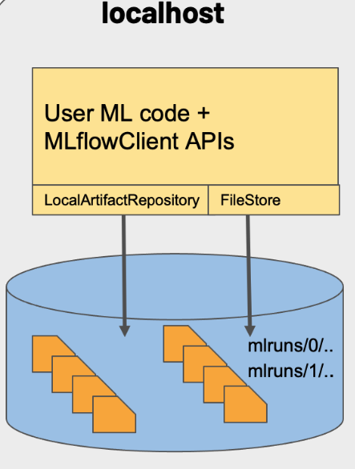
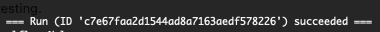

# Infrastructure Tutorial

 ✅ **Technical Requirement**
 1. Macbook
 2. The latest version of Docker, version *** at the time we write the turorial 
 3. The latest version of  Docker compose, version *** at the time we write the turorial 
 4. accesss to bash in terminal
 
 
## Setup Docker 
Environment and setup before setting up docker. 

### Download 

**Option 1** 

Download Docker desktop by running the following:

1. Download the Package Manager *homebrew* for MAC.  -- skip if already download 
```
/bin/bash -c "$(curl -fsSL https://raw.githubusercontent.com/Homebrew/install/HEAD/install.sh)"
```

Please refer to the [installation page](https://brew.sh/)

2. Download the docker desktop software by using brew install command. 

```
brew install --cask docker
```


**Option 2** 

1. Install Docker Desktop: Download Docker Desktop for Mac from the official website (https://www.docker.com/products/docker-desktop) and follow the installation instructions.

2. Start Docker Desktop: Once the installation is complete, start Docker Desktop.


### Verification 
Verify Docker Installation: Open the terminal and run the following command to verify that Docker is installed and running:
```
docker run hello-world
```

The result you should see after successfully pull the hello-world image.
```
Hello from Docker!
This message shows that your installation appears to be working correctly.
```

### Introduction to Docker

**Note:**

Docker is an open-source platform that enables developers to automate the deployment, scaling, and management of applications inside containers. 
Docker's architecture is built on top of Linux Containers (LXC), which provides a secure and isolated environment for applications to run. Docker containers are isolated from each other and from the host operating system, making it easier to manage applications and ensure their security. Additionally, Docker images are created from a set of instructions called a Dockerfile, which makes it easier to automate the build and deployment process.

**Basic Commands**

1. docker run: This command is used to run a Docker container. You can specify the image to use, set environment variables, and configure other options when running a container.

2. docker ps: This command is used to list the containers that are currently running. It displays information such as the container ID, image name, status, and ports. Note: docker ps -a will display all the previous containers. 

3. docker images: This command is used to list the Docker images that are available on the system. You can use this command to see the size of each image, when it was created, and other metadata.

4. docker pull: This command is used to download a Docker image from a registry, such as Docker Hub. You can specify the image name and optionally the version to pull.

5. docker stop: This command is used to stop a running container. You can specify the container ID or name to stop.

6. docker rm: This command is used to remove a Docker container. You can specify the container ID or name to remove.

7. docker exec: This command is used to run a command in a running container. You can specify the container ID or name and the command to run.

8. docker build: This command is used to build a Docker image from a Dockerfile. You can specify the path to the Dockerfile and the name and tag for the resulting image.

Please explore the [tutorial sections](https://docs.docker.com/get-started/) of docker to familiarize yourselves with those commands.


## Setup MLFlow in Docker

### Understanding of mlflow deloying in docker container

When we run MLflow on local machine or deploy mlflow in dockers, if the location of backend and artifact store was not specify in the setting, they will share a directory on the local filesystem—./mlruns as shown in the graph. 



### Dockerize model training with mlflow

The benefits of using docker container over conda environment to use mlflow are the following:
- Reproducibility: Docker containers allow you to capture the complete runtime environment of an MLflow experiment, including the operating system, dependencies, and configuration. This makes it easier to reproduce experiments and share them with others.

 - Scalability: Docker containers can be easily deployed to a cluster, allowing you to scale your experiments as needed. You can also take advantage of cloud services like Amazon Web Services (AWS) or Google Cloud Platform (GCP) to run large-scale experiments.

⏭ **Installation**

1. Install docker (following the first section if you have not done so.)
2. Install conda environment 

**Option 1** with homebrew
```
brew install --cask miniconda
```
**Option 2** by following the [conda website](https://conda.io/projects/conda/en/latest/user-guide/install/macos.html)


3. Setup virtual environment in conda and install mlflow 

```
pip install mlflow
```

⏭ **Running the example**

First, enter the folder of docker_example, and the perform the following: 


  - Bulid mlflow docker image


First, build the image for the project's Docker container environment. You must use the same image name that is given by the docker_env.image field of the MLproject

```
FROM python:3.9

COPY . .

RUN pip install -r requirements.txt
```
The dockerfile is firstly install the python environment, then copy the current files to the docker container file directory. And then we install the required packages as stated in requirements.txt file. 

Build the mlflow docker image by using this Dockerfile via the following:
```
docker build -t mlflow-docker-example -f Dockerfile .
```

- Run this mlflow example 

The MLproject file is the following: 
```
name: docker-example

docker_env:
  image:  mlflow_in_docker

entry_points:
  main:
    parameters:
      alpha: float
      l1_ratio: {type: float, default: 0.1}
    command: "python train.py --alpha {alpha} --l1-ratio {l1_ratio}"
```

Run the example project via:
```
mlflow run . -P alpha=0.5
```

If the setups are successful, you should see the following:




## FAQ

